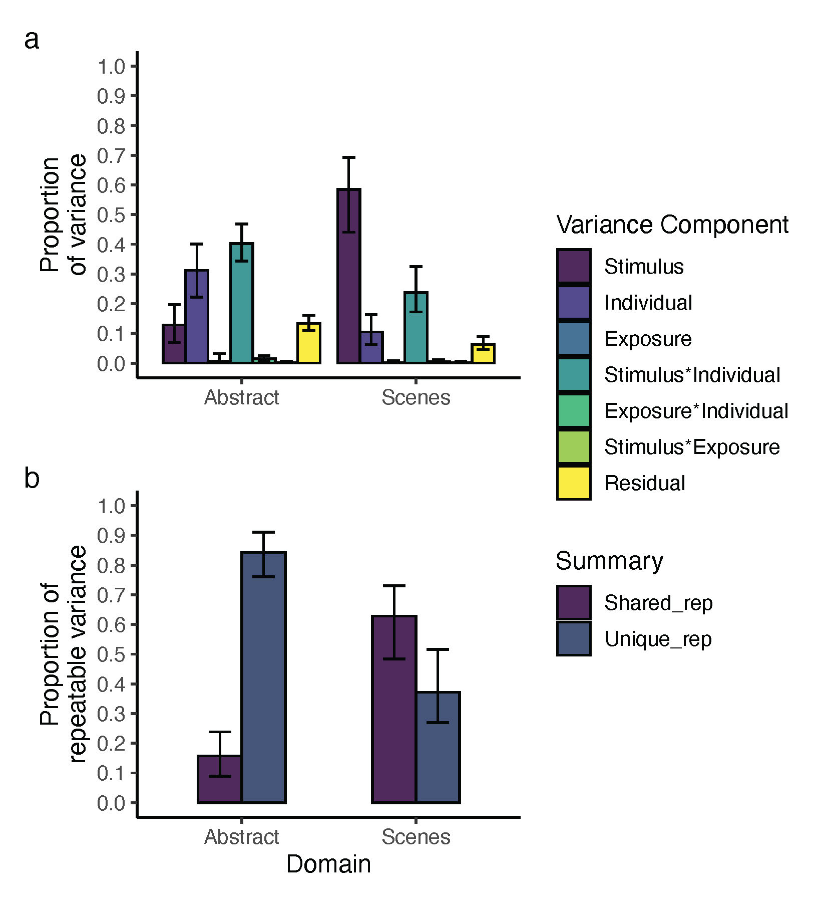

This branch contains useful scripts and examples to decompose the variance in aesthetic ratings.

## 01_Data

It contains example data obtained from [Germine et al., 2015](https://pubmed.ncbi.nlm.nih.gov/26441352/). Original data can be found at https://osf.io/c3hz6/.
Laura Germine kindly granted permission to use the data for this tutorial.

## 02_scripts/R

It contains an example .R scripts to run:

+ 01_VCA.R: Example to calculate [Variance Component Analysis (VCA)](https://pubmed.ncbi.nlm.nih.gov/31898288/): Calculate the amount of variance in a given trait of interest (e.g., pleasantness) that is shared across and unique to individuals. It takes into account systematic differences between repeated exposures to the same stimulus. 
+ functions/vca_exposure.r: Function to perform VCA, including the effect of repeated exposure on aesthetic ratings. It outputs Variance Partitioning Coefficient estimates (VPC)
+ functions/vca_exposure_tidyCI.r : Function to calculate 95% CI of the VPC estimates.

## 03_outputs

It contains output from 02_scripts/R

## 04_images

It contains images generated from 02_scripts/R

## Example

The example in 01_VCA.R answers the following question.

Question:
Are states (e.g., perceived beauty, aesthetic appreciation) evoked by sensory stimulation mostly shared, or are they mostly unique to individuals? 

Answer:
VCA answer this question by partitioning the amount of variance in a given state of interest, evoked by a set of stimuli, into variance shared across or/and unique to individuals. 

When variance is mainly shared, there is little room for inter-individual differences. For example, this could happen when everyone experience (and report) the same level of felt beauty from a set of images. 
When variance is primarily unique, states evoked by the stimulus/i are highly variable across individuals. For example, this could happen when there is a high disagreement between individuals on what is perceived (and reported) to be beautiful. 

01_VCA.R provides this answer by using random intercept only multilevel modelling

How:
To extract Variance Partitioning Coefficients (VPC), VCA can be carried out via [random intercept only multilevel modelling ](https://pubmed.ncbi.nlm.nih.gov/28481616/)

Since estimating the noisiness of the individual reported states is necessary, VCA requires repeated ratings. This requirement also allows VCA to consider and quantify systematic differences between repeated exposures of the same stimulus.

Example: 
+ R/01_VCA.R

Here, a sub-sample of 60 unrelated individuals rated 30 abstract images and scenes. The variance in ratings is decomposed using VCA (data are obtained from [Germine et al., 2015](https://pubmed.ncbi.nlm.nih.gov/26441352/) via https://osf.io/c3hz6/; see [Bignardi et al., preprint](https://psyarxiv.com/79nbq) for details).

### MLM

Function: 02_scripts/R/functions/vca_exposure.r
VCA_exposure() function can be used to perform MLM 

The random effects of the model are:
+ the stimuli
+ the individuals' intercepts (i.e., the intra-indiviudal mean ratings)
+ the blocks in which the stimuli were rated more than once
+ their 2-way interactions (totalling 3 interactions). 

### VCA
VCA_exposure() enables to partition variance in the amount of variance:

+ $VPC_{stimulus}$: explained by the stimuli
+ $VPC_{individual}$: explained by the individuals
+ $VPC_{stimulsXindividual}$: explained by the interaction between the individuals' ratings and the stimulus rated
+ $VPC_{block}$: explained by the repetition of the stimuli
+ $VPC_{individualXblock}$:  explained by the interaction between the individuals' ratings across repetitions
+ $VPC_{stimulusXblock}$:  explained by the interaction between the stimulus rated across repetitions
+ $VPC_{error}$: explained by residual variance

NOTE: sum of VPC will be equal to 1:

$VPC_{stimulus}$ + $VPC_{individual}$ + $VPC_{stimulsXindividual}$ + $VPC_{block}$ + $VPC_{individualXblock}$ + $VPC_{stimulusXblock}$ + $VPC_{error}$ = 1

The code outputs two versions of VPC. The first is the ratio between the variance component over the overall variance. The second is the ratio between the variance component over the overall variance from which the residual variance was  subtracted first (i.e., the repeatable variance)

Moreover, this function directly outputs the "summary" of the VPC, which is the amount of repeatable variance that is unique or shared across individuals:

 $$mBi = VPC_{individual} + VPC_{stimulsXindividual} + VPC_{individualXblock}$$

*mBi* refers to the modified [Beholder Index](https://pubmed.ncbi.nlm.nih.gov/16634665/). Specifically, it is type 2 Bi and assumes that the variance represented by $VPC_{participant}$ is meaningful (since we found terms related to this VPC [to be heritable](https://psyarxiv.com/79nbq), even after accounting for confounders, we consider this to be meaningful). There are two versions of mBi: one that includes residual variance and one that excludes it. The output from the example provided excludes residual variance.

Given *mBi*, then 

$$PropVariance_{Unique} = mBi$$
$$PropVariance_{Shared} = 1 - mBi$$

Confidence intervals are computed using 2000 bootstrap samples, following [Sutherland et al. (2020)](https://pubmed.ncbi.nlm.nih.gov/32341163/)

### PLOTTING

A final figure representing the VPC is plotted in 04_images. The first panel depicts the proportion of overall variance in ratings estimated to be due to random effects and their interaction. The second panel summarize the results using the *mBi*.

For the given example, we can see that abstract images evoked states that are relatively more unique than shared, while the contrary is true for images of scenes.

###  References

Bignardi, G., Smit, D., Vessel, E. A., Trupp, m. D., Ticini, L. F., Fisher, S., & Polderman, T. J. (2023, February 28). Shared and Distinct Genetic Sources of Variability in Visual Aesthetic Value. https://doi.org/10.31234/osf.io/79nbq

Germine, L., Russell, R., Bronstad, P. M., Blokland, G. A., Smoller, J. W., Kwok, H., Anthony, S. E., Nakayama, K., Rhodes, G., & Wilmer, J. B. (2015). Individual Aesthetic Preferences for Faces Are Shaped Mostly by Environments, Not Genes. _Current biology : CB_, _25_(20), 2684–2689. https://doi.org/10.1016/j.cub.2015.08.048

Hehman, E., Sutherland, C. A. M., Flake, J. K., & Slepian, M. L. (2017). The unique contributions of perceiver and target characteristics in person perception. _Journal of personality and social psychology_, _113_(4), 513–529. https://doi.org/10.1037/pspa0000090

Hönekopp J. (2006). Once more: is beauty in the eye of the beholder? Relative contributions of private and shared taste to judgments of facial attractiveness. _Journal of experimental psychology. Human perception and performance_, _32_(2), 199–209. https://doi.org/10.1037/0096-1523.32.2.199

Martinez, J. E., Funk, F., & Todorov, A. (2020). Quantifying idiosyncratic and shared contributions to judgment. _Behavior research methods_, _52_(4), 1428–1444. https://doi.org/10.3758/s13428-019-01323-0

Sutherland, C. A. M., Burton, N. S., Wilmer, J. B., Blokland, G. A. M., Germine, L., Palermo, R., Collova, J. R., & Rhodes, G. (2020). Individual differences in trust evaluations are shaped mostly by environments, not genes. _Proceedings of the National Academy of Sciences of the United States of America_, _117_(19), 10218–10224. https://doi.org/10.1073/pnas.1920131117

### Further References

Vessel, E. A., Pasqualette, L. B. B. B., Uran, C., Koldehoff, S., & Vinck, M. (2021, October 1). Self-relevance predicts the aesthetic appeal of real and synthetic artworks generated via neural style transfer. https://doi.org/10.31234/osf.io/pnu3r

Vessel, E. A., Ishizu, T., & Bignardi, G. (2022). Neural correlates of visual aesthetic appeal. In _The Routledge international handbook of neuroaesthetics_ (pp. 103-133). Routledge.

