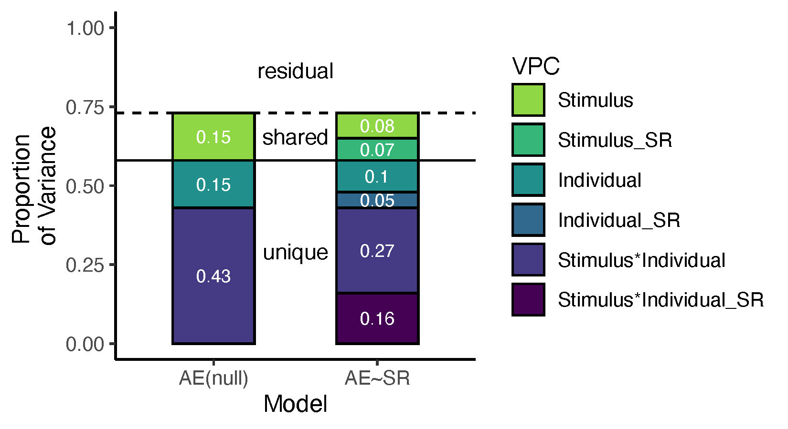

This branch contains useful scripts and examples to decompose the variance in aesthetic ratings.

## 01_Data

It contains example data from [Vessel et al., under review](https://psyarxiv.com/pnu3r/). Original data can be found at (insert link OSF here)

## 02_scripts/R

It contains an example .R scripts to run:

+ 02_rcVCA.R: Example to calculate the approximate relative contribution of fixed effect of a second Independent Variable to Variance Components. 
+ functions/rcvca.r: Function to perform rcVCA.

## 03_outputs

It contains output from 02_scripts/R

## 04_images

It contains images generated from 02_scripts/R

## Example

The example in 02_rcVCA.R tries to answer the following question.

Question:
To what extent another state evoked in the individual (e.g., perceived self-relevance) or a feature in the sensory stimulus (e.g., symmetry) "explain" parts of the variance that is unique or shared to the individual? 
Note: the example focuses only on perceived self-relevance

It does so by providing an approximate answer.

Answer:
rcVCA answers this question by approximating the amount of variance in the random effects that are accounted for by including the fixed effect (e.g., self-relevance).

And this is done via linear mixed modelling.

How:
Extension of the random intercept only multilevel models that are being used to extract [Variance Partitioning Coefficient (VPC)](_https://pubmed.ncbi.nlm.nih.gov/31898288/)

### MLM

First, we compute random effects for the null model.

For simplicity, rcVCA omits the Block (or Exposure) VPC, which leaves the following:

+ the stimuli
+ the participants' intercepts
+ their 2-way interactions (1 interaction). 

+ $VPC_{stimulus}$: explained by the stimuli
+ $VPC_{individual}$: explained by the individual
+ $VPC_{stimulsXindividual}$: explained by the interaction between the individual's experience and the stimulus experienced

If no null model is given (null = F), then rcvca() is reduced to a VCA of the mlm (without the exposure term)

### rcVCA

The idea is to get a proxy for the amount of VPC accounted for by (or better, covarying with) the fixed effects by simply subtracting the $VPC_{fixed}$ from the $VPC_{null_{i}}$

$$rcVPC_{i} = VPC_{null_{i}} - VPC_{fixed}$$

Which gives the amount of variance dropped in any $VPC_{i}$ where i is either the stimulus, the individual or their interaction after including the fixed effect.

### PLOTTING

A final figure representing the VPC null (on the left) and the rcVPC of the fixed effect (on the right) is plotted in 04_images. Each new bar in the right part of the figure represents the amount of VPC covarying with the fixed effect (in the example, self-relevance). 

### References

Vessel, E. A., Pasqualette, L. B. B. B., Uran, C., Koldehoff, S., & Vinck, M. (2021, October 1). Self-relevance predicts the aesthetic appeal of real and synthetic artworks generated via neural style transfer. https://doi.org/10.31234/osf.io/pnu3r

